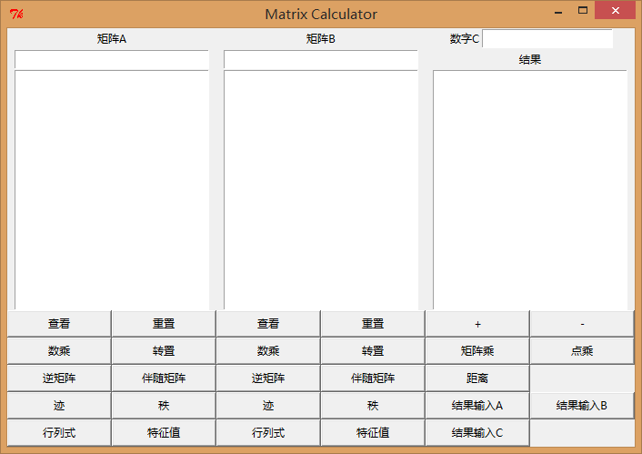

## 简单矩阵计算器

### 软件工程小组

1. 组长：杨雪
2. 组员：刘伟森、汪超

### 目标

利用Python实现一个能够实现矩阵加减乘逆等基本运算的小型计算器，完善图形界面（，更进一步地实现记录计算日志的功能......）。

### 项目说明
1. 运行环境：python2.7+numpy
2. 运行：终端输入python MatrixCalculator.py
3. 界面：

4. 输入输出：共有三个输入框，三个输出框，只有一行高度的为输入框，高度较高的为输出框。  
矩阵输入格式：  
行优先输入，每一行的元素之间以空格或逗号隔开，行与行之间用分号隔开，如：  
两行两列的矩阵：  
1 2;3 4 或 1,2;3,4  
注意：符号均使用英文下的符号，不可使用中文下的符号  
数字输入格式：整型、浮点型、科学计数法输入均可  
5. 操作：输出框下方为按钮，矩阵A和矩阵B有相同的操作，输入数据后，点击下方对应按钮即可对相应的矩阵进行操作，结果输出框下方的按钮为两个矩阵之间的计算，或者将结果输入到输入框中
6. 功能：  
查看：查看当前矩阵，输出在对应的输出框中，不是矩阵报错  
重置：重置矩阵输入  
数乘：对应矩阵和数字进行数乘，输出在结果框中，不是数字报错  
转置：将对应矩阵转置，输出在结果框中  
逆矩阵：求对应矩阵的逆矩阵，输出在结果框中，不可逆报错  
伴随矩阵：求对应矩阵的伴随矩阵，输出在结果框中，不是方阵报错  
迹：求对应矩阵的迹，输出在结果框中，不是方阵报错  
秩：求对应矩阵的秩，输出在结果框中  
行列式：求对应矩阵的行列式，输出在结果框中，不是方阵报错  
特征值：求对应矩阵的特征值，输出在结果框中，不是方阵报错  
+：矩阵相加，输出在结果框中，矩阵形状不同报错  
-：矩阵相减，输出在结果框中，矩阵形状不同报错  
矩阵乘：矩阵相乘，输出在结果框中，A的列数不等于B的行数报错  
点乘：矩阵对应元素相乘，输出在结果框中，矩阵形状不同报错  
距离：求矩阵之间的欧氏距离，输出在结果框中，矩阵形状不同报错  
结果输入A：将结果输入A的输入框中  
结果输入B：将结果输入B的输入框中  
结果输入C：将结果输入C的输入框中，将矩阵结果输入报错  
